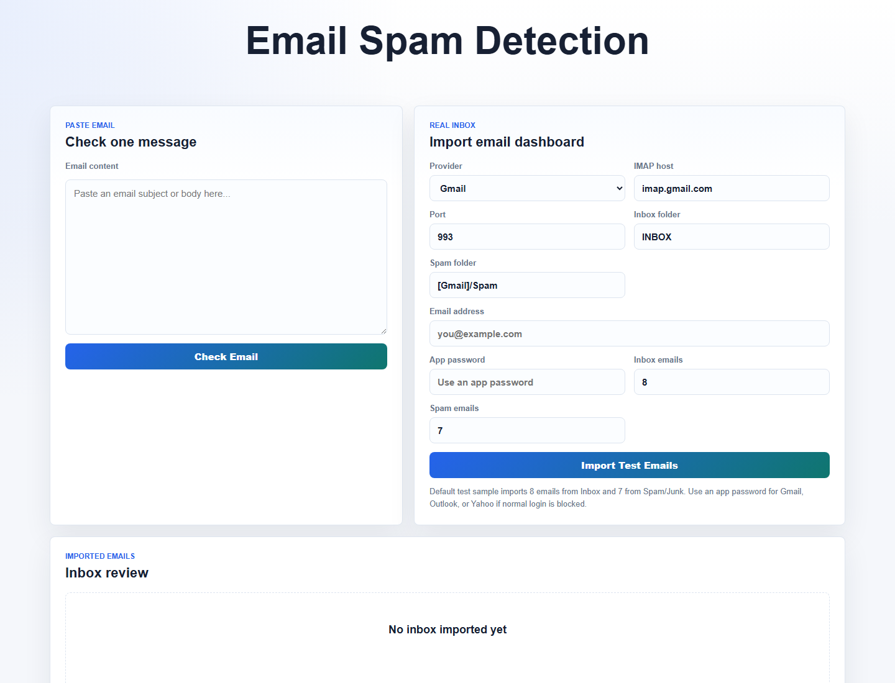
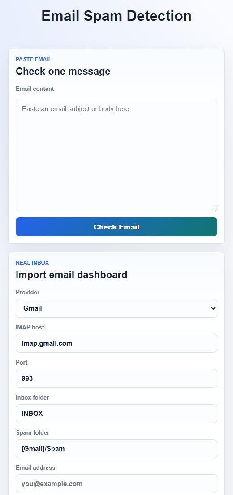

# Email Spam Detection

A Flask-based web application for classifying email messages as **Spam** or **Ham** using a trained TF-IDF vectorizer and Logistic Regression model. The app supports quick manual text checks and optional real inbox imports through IMAP.

## Interface Preview

### Desktop



### Responsive Layout



## Features

- Paste an email subject or body and classify it instantly.
- Import recent emails from Gmail, Outlook/Hotmail, Yahoo, or a custom IMAP server.
- Review imported inbox and spam-folder messages in a dashboard layout.
- View spam/ham labels with confidence scores.
- Uses saved ML artifacts for fast local predictions.
- Responsive interface for desktop and smaller screens.

## Tech Stack

- **Backend:** Python, Flask
- **Machine Learning:** scikit-learn, TF-IDF, Logistic Regression
- **Text Processing:** NLTK, regex preprocessing
- **Email Import:** IMAP over SSL
- **Frontend:** HTML, CSS, Jinja templates

## Project Structure

```text
Email-Spam-Detection/
+-- main.py
+-- LR_model.pkl
+-- tfidf.pkl
+-- requirements.txt
+-- README.md
+-- docs/
|   +-- screenshots/
|       +-- desktop-home.png
|       +-- mobile-home.png
+-- static/
|   +-- style.css
+-- templates/
    +-- index.html
```

## Requirements

- Python 3.10+
- Flask
- beautifulsoup4
- scikit-learn
- nltk

The full dependency list is included in `requirements.txt`.

## Installation

Clone or open the project folder, then create a virtual environment:

```powershell
python -m venv .venv
```

Activate the virtual environment on Windows PowerShell:

```powershell
.\.venv\Scripts\Activate.ps1
```

Install dependencies:

```powershell
pip install -r requirements.txt
```

If you only need the runtime dependencies, install:

```powershell
pip install Flask beautifulsoup4 scikit-learn nltk
```

## Run the Application

Start the Flask app:

```powershell
python main.py
```

Open the local app in your browser:

```text
http://127.0.0.1:5000/
```

On first run, NLTK may download required language data such as `wordnet` and `stopwords`.

## How It Works

1. User text is cleaned by removing HTML, URLs, punctuation, extra spaces, and stop words.
2. The cleaned message is transformed with the saved `tfidf.pkl` vectorizer.
3. The trained `LR_model.pkl` Logistic Regression model predicts spam probability.
4. A lightweight suspicious-keyword score is also considered for stronger spam signals.
5. The app returns a final label: `Spam` or `Ham`.

## Using Real Email Import

The inbox dashboard uses IMAP to read recent emails from your mailbox. Select a provider, enter your email address, app password, folder name, and import limits.

Common IMAP settings:

| Provider | IMAP Host | Port | Spam/Junk Folder |
| --- | --- | --- | --- |
| Gmail | `imap.gmail.com` | `993` | `[Gmail]/Spam` |
| Outlook / Hotmail | `outlook.office365.com` | `993` | `Junk Email` |
| Yahoo Mail | `imap.mail.yahoo.com` | `993` | `Bulk Mail` |

Most email providers require an app password instead of your normal account password. Create one from your account security settings before using the import feature.

## Model Files

The app expects these trained artifacts in the project root:

- `tfidf.pkl`
- `LR_model.pkl`

Keep both files in the root directory when running the application.

## Security Notes

- Email credentials are used only during the current import request.
- Credentials are not saved by the application.
- Do not commit `.env` files, logs, virtual environments, or secrets.
- This project uses Flask's development server and is intended for local demos or development.

## Troubleshooting

If you see `ModuleNotFoundError: No module named 'bs4'`, install BeautifulSoup inside the active virtual environment:

```powershell
.\.venv\Scripts\python.exe -m pip install beautifulsoup4
```
If `python main.py` uses the wrong Python installation, run the project explicitly with the virtual environment Python:

```powershell
.\.venv\Scripts\python.exe main.py
```
